# Understanding how the web works

## What do we actually type in the browser

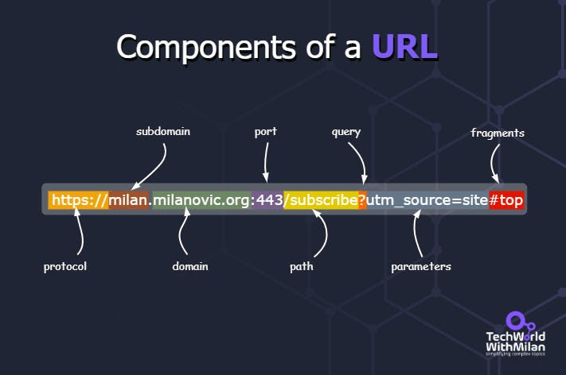

Reference: [techworld with milan](https://newsletter.techworld-with-milan.com/p/what-happens-when-you-type-a-url)

## How do we get the page

A High Level Overview of Requesting and Serving a WebPage

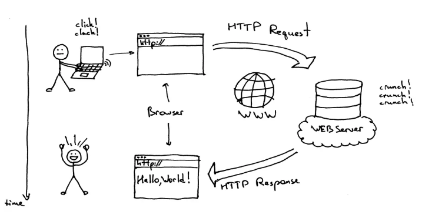

Reference: [Browserstack](https://www.browserstack.com/guide/what-is-browser)

## How to we reach the correct server

Adding DNS to the picture

Reference: [Pressidium's Blog](https://pressidium.com/blog/2016/how-the-web-works-what-happens-when-you-visit-a-url/)

## Do we fetch the address each time

Caching of DNS at different levels

Reference: [Bytebytego blog](https://blog.bytebytego.com/p/what-happens-when-you-type-a-url)

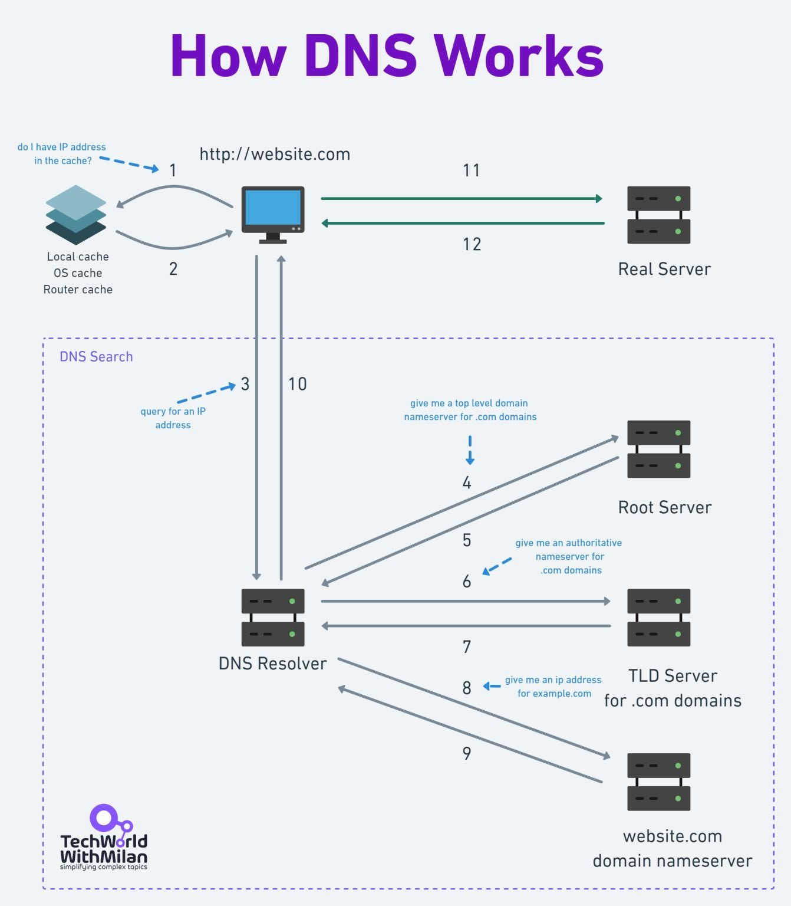

Reference: [techworld with milan](https://newsletter.techworld-with-milan.com/p/what-happens-when-you-type-a-url)

[The whole story in a fun way](https://howdns.works/)

## Do we say hello before starting our conversation

TCP 3-way handshake before sending the request

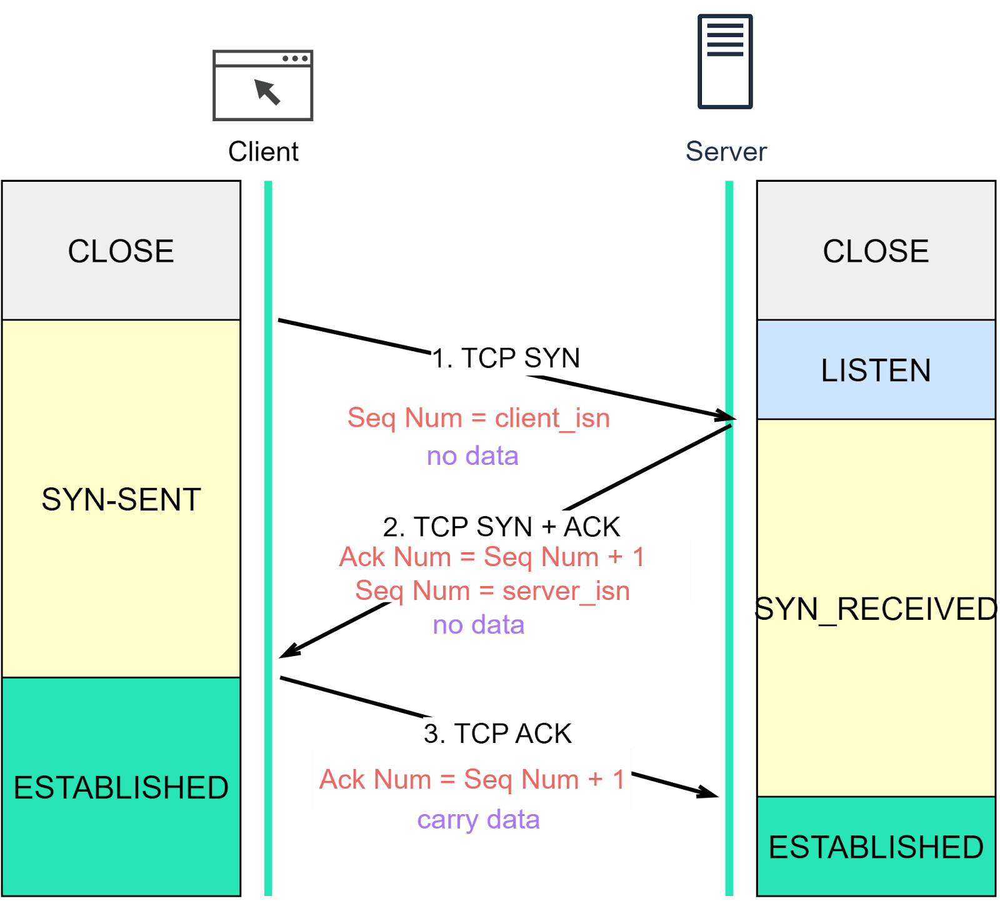

TCP 4-way close connection (way of saying bye)

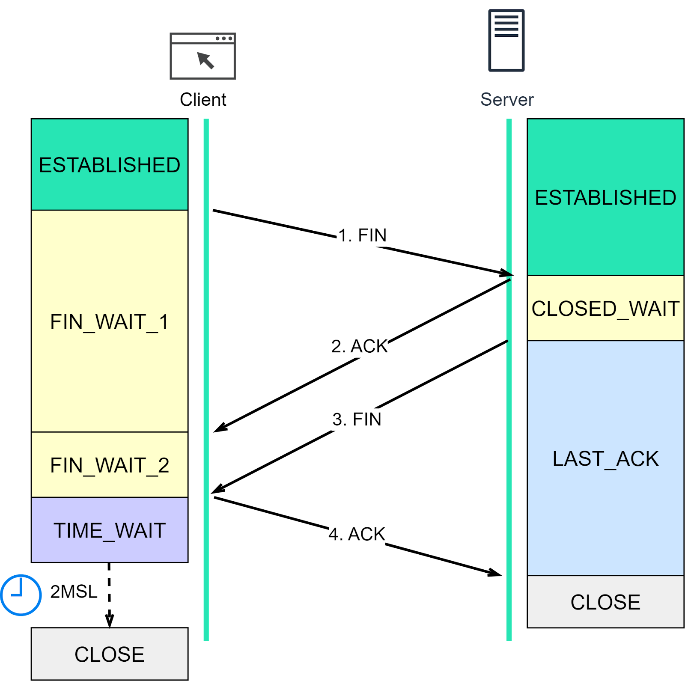

Reference: [Bytebytego blog](https://blog.bytebytego.com/p/everything-you-always-wanted-to-know)

## How do we send and recive data

HTTP, or HyperText Transfer Protocol used over TCP (http 1.1 introducing keep-alive, and http 2.0 introducing streaming)

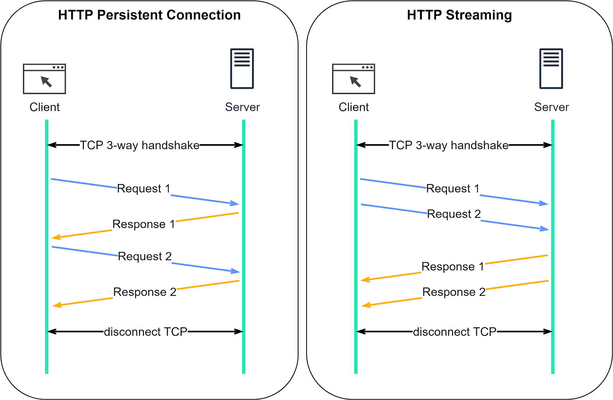

HTTP is evolving, mainly to resolve HOL blocking with introducing HTTP over QUIC (based on UDP)

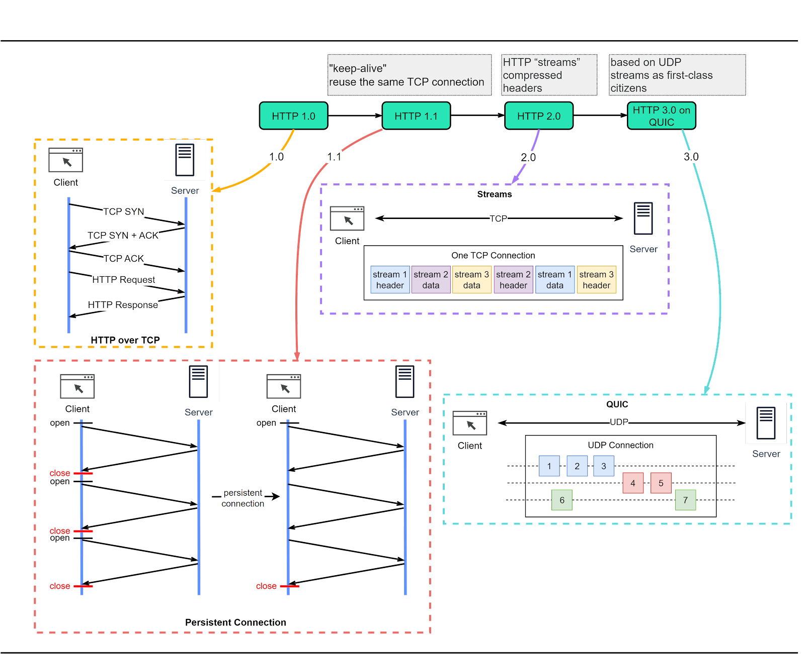

Reference: [Bytebytego blog](https://blog.bytebytego.com/p/the-foundation-of-rest-api-http)

HTTP usage report by Cloudflare in 2023

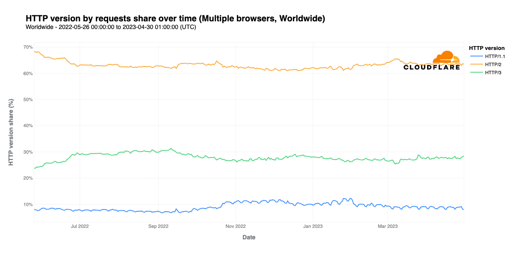

Reference: [Cloudflare Blogs](https://blog.cloudflare.com/http3-usage-one-year-on/)

## Is it secure? If not, how do we secure it?

HTTPs encrypts http communication during transit

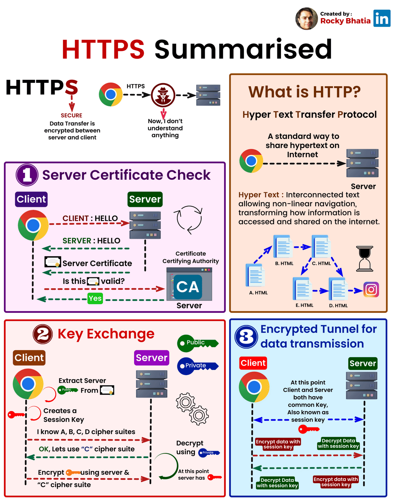

Reference: [Rocky Bhatia](https://medium.com/@rocky.bhatia86/in-the-expansive-universe-of-the-internet-where-the-exchange-of-information-is-ceaseless-the-1ffcdad011d1)

Fitting it into the general flow

Reference: [Bytebytego blog](https://blog.bytebytego.com/p/how-does-https-work-episode-6)

## How Does Browser Renders when it only received hyptertext

Understanding browser Components

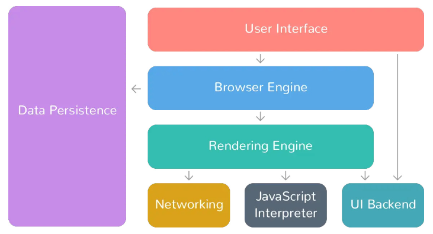

Reference: [Browserstack](https://www.browserstack.com/guide/what-is-browser)

4-part series of different operations of a browser

https://developer.chrome.com/blog/inside-browser-part1
https://developer.chrome.com/blog/inside-browser-part2
https://developer.chrome.com/blog/inside-browser-part3
https://developer.chrome.com/blog/inside-browser-part4

Another similar post

https://cabulous.medium.com/how-browser-works-part-i-process-and-thread-f63a9111bae9
https://cabulous.medium.com/how-does-browser-work-in-2019-part-ii-navigation-342b27e56d7b
https://cabulous.medium.com/how-does-browser-work-in-2019-part-iii-rendering-phase-i-850c8935958f
https://cabulous.medium.com/how-does-browser-work-in-2019-part-4-more-about-rendering-phase-fbba0d94a174
https://cabulous.medium.com/how-does-browser-work-in-2019-part-5-optimization-in-the-interaction-stage-66b53b8ec0ad

## Summarizing the complete picture

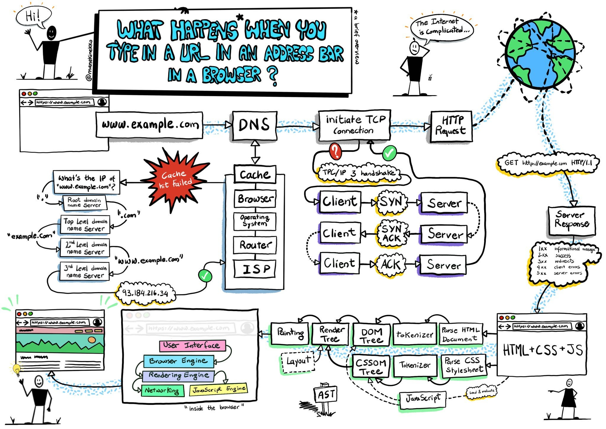

Reference: [techworld with milan](https://newsletter.techworld-with-milan.com/p/what-happens-when-you-type-a-url)

## Play around a bit

https://messwithdns.net/

## Interesting facts

[$150K Stolen From MyEtherWallet Users in DNS Server Hijacking](https://www.coindesk.com/markets/2018/04/24/150k-stolen-from-myetherwallet-users-in-dns-server-hijacking)

# How Can I host my website?

## Check for Domain

Many domain providers e.g. for .pk directly purchaing from PKNIC

Reference: [pknic](https://www.pknic.net.pk/)

## Potentially Buy a Domain

Check pricing, make payment, and purchase

Reference: [pknic](https://www.pknic.net.pk/pricing.html)

## Purchase and setup hosting solution

Reference: [AWS Community](https://community.aws/content/2cKcil6YsGXvycaezdaNSjS6r2b/types-of-web-hosting)

[Skimming through some options and pricing](https://neilpatel.com/blog/best-web-hosting-services/)

## Setup listner and your webfiles on server

It depends on type of your hosting solution and web applications. However, a quickly overview using nginx + html/css/js

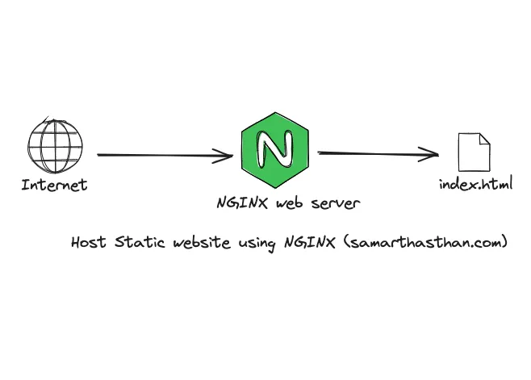

Reference: [Samarth Asthan](https://medium.com/@samarthasthan/host-your-static-website-using-nginx-a-step-by-step-guide-dc136fa6a308)

## Add DNS record

Direct using A/AAAA/CName

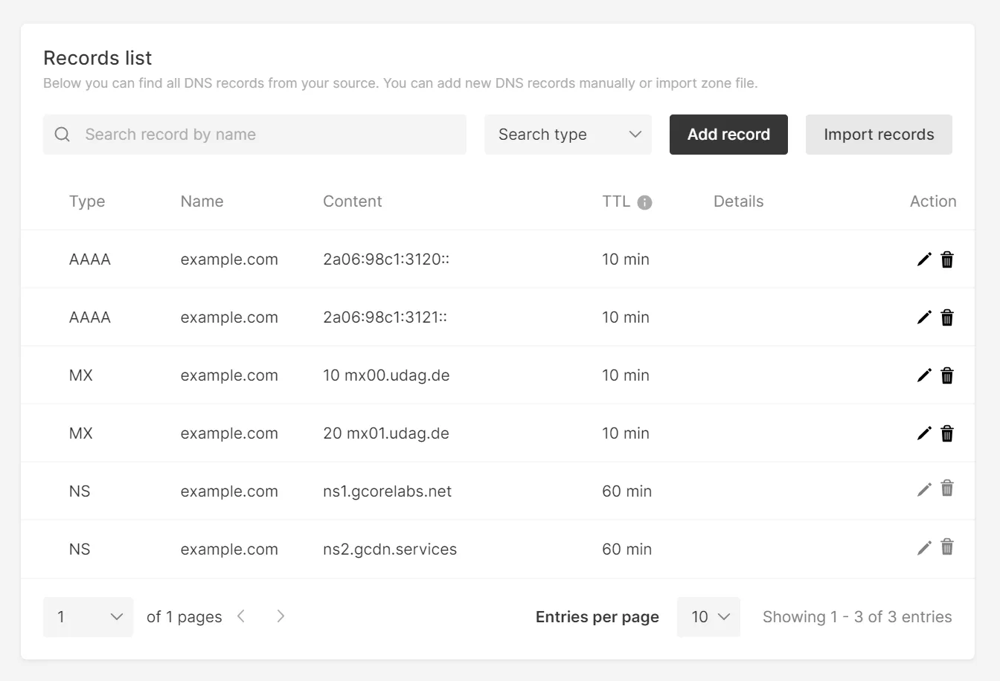

Others include NS, MX, TXT, etc

## Add SSL (Buy? Generate? Get a Free?)

Let's Encrypt can be used to quickly generate short lived ssls

Reference: [Let's Encrypt](https://letsencrypt.org/how-it-works/)
