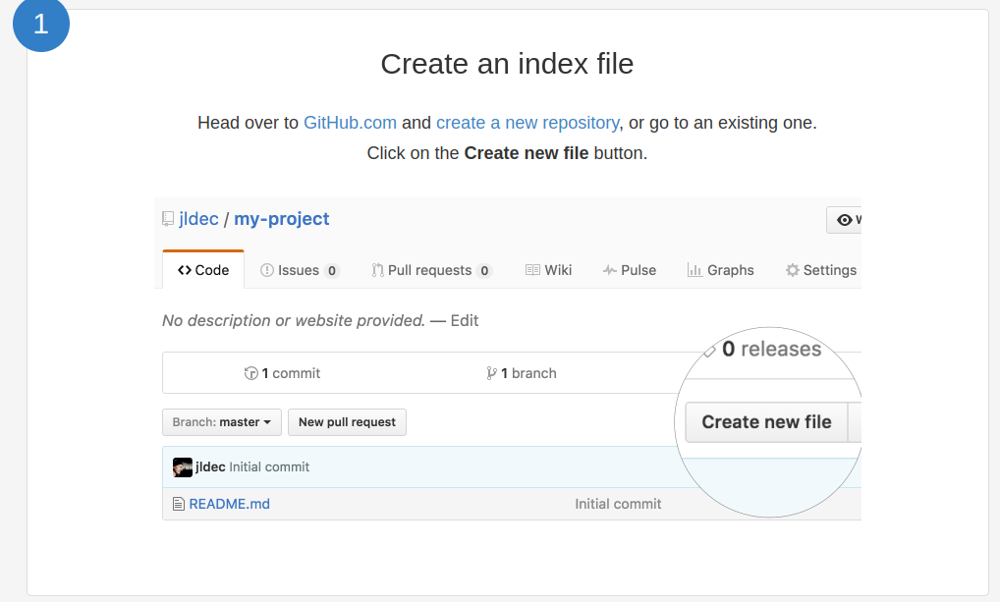
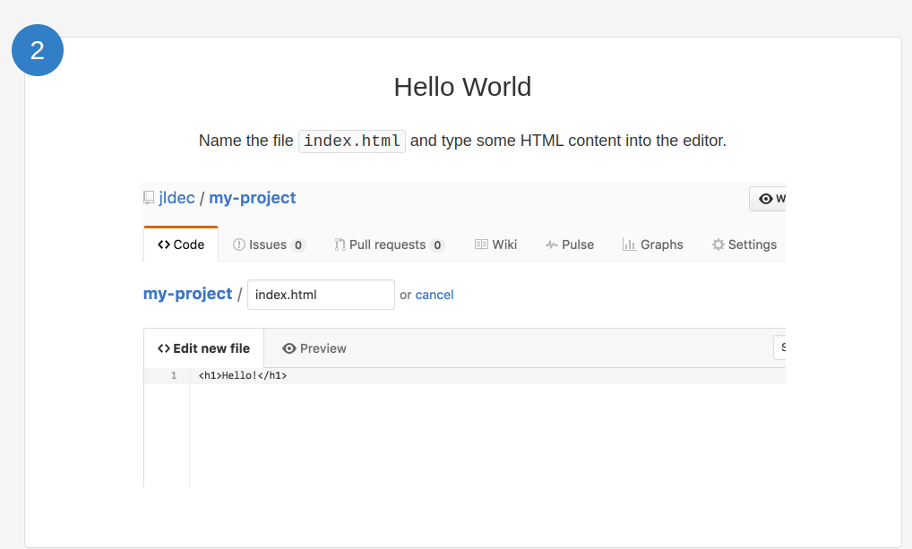
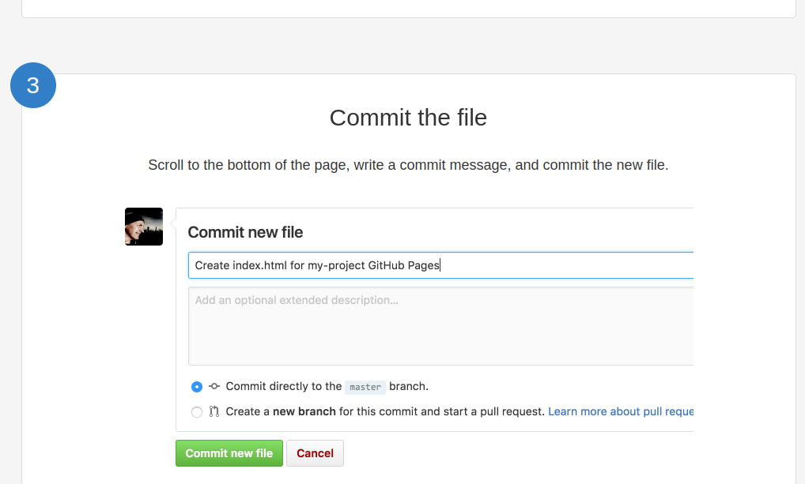
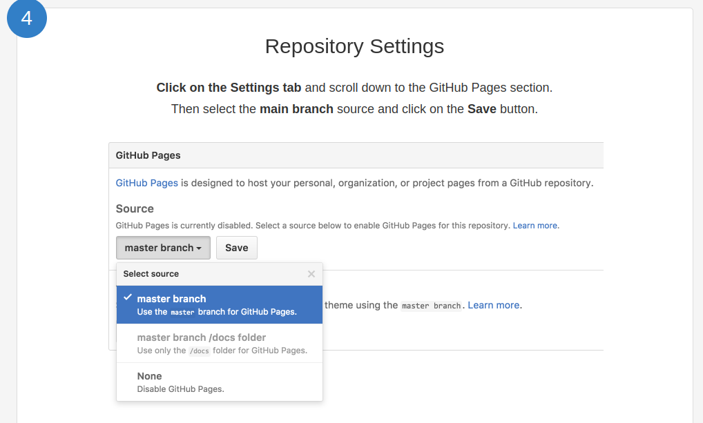
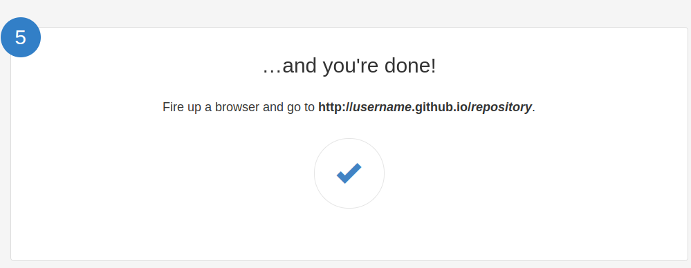

# Let's Build a Static Website

Let's build the following project today using HTML, CSS, and JS

We will build this basic project as available in 

/
- [index.html](./project_01/index.html)
- [style.css](./project_01/style.css)
- [script.js](./project_01/script.js)

## Concepts to Understand

#### HTML

- Basic structure including Doctype, Head and Body
- head components including, meta, title, external resources
- HTML5 layout tags including header, nav, main, section, footer
- HTML tags including UL+LI, a, h2, p, form, label, input of different types, button
- HTML attributes like href, styles, id, type, name, 
- The behavior of Spaces, new lines, special characters behave.

#### CSS

- Inline, internal and external CSS
- CSS selector tags based
- Basic styles including background, color, margin, margin-bottom, padding, font-family, box-sizing, line-height, list style, gap, border, text-align

#### JS

- Loading Javascript with htmls
- DevTools and Browser Console. Javascript in browser console.
- DOM and document variable
- Get element by ID
- Event Listner
- Passing functions as Callback functions

# Potentially Discuss Hosting of the website using Github, and Github Pages

## Steps to follow:
- https://pages.github.com/

## Briefly putting it here:

- Create a project on Github

- Upload to Github (Or directly create the files in Github using Github interface)

- Commit to file

- Apply settings

- Open the website
